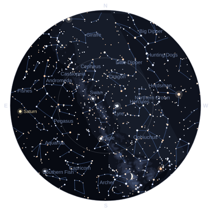

# Night Sky

An Omarchy bar widget showing the constellations above you right now, with
sunrise and sunset times.

The bar shows the next sun event — `↓ 20:41` before sunset, `↑ 06:12` after.
Clicking it opens an all-sky chart: the whole visible hemisphere on one disc,
zenith at the centre and the horizon around the rim, with the constellation
figures, the Milky Way, the planets and the Moon at its real phase.



## What it draws

- **5,044 stars** to magnitude 6.0, sized by brightness and tinted by their real
  B–V colour index — Arcturus and Betelgeuse amber, Vega and Rigel blue-white.
- **89 constellation figures**, joined along great circles so the shapes stay
  true near the horizon where the projection stretches hardest.
- **The Milky Way**, as five nested brightness contours.
- **Mercury through Saturn**, at their real positions, labelled.
- **The Moon**, drawn at its actual illuminated fraction.
- **Sunrise, sunset and day length**, plus the current Moon phase.

Hover any planet, the Moon, or a bright named star for its name and magnitude.

## The sky is computed offline

There is no sky API. Star positions, constellation figures, the Milky Way outline
and planetary orbital elements are bundled with the plugin, and every position is
computed on your machine by `SkyMath.js`.

That means the chart draws correctly with no network at all, redraws instantly
when you change location or settings, and can never be rate-limited. It also
means the accuracy is checkable, and it has been checked — `tools/run-checks.sh`
compares the results against Open-Meteo and NASA JPL's Horizons ephemeris:

| Quantity | Worst observed error |
|---|---|
| Sunrise / sunset | 63 s across 30 events, latitudes −34° to +64° |
| Planet positions | 5.0 arcmin (Saturn); the rest under 1.1 arcmin |
| Moon position | 28 arcmin, about one lunar diameter |
| Star positions | exact — the catalogue is J2000 |

The chart draws 90° of altitude across roughly 190 pixels, so every one of those
is between sub-pixel and one pixel on screen.

## Network use

Three requests, all to free services, none needing an API key. Only your location
ever leaves the machine — never what you are looking at.

| Service | What for | Published limit | What this plugin does |
|---|---|---|---|
| [ipwho.is](https://ipwho.is) | Approximate location from your IP, plus your timezone | 1,000/day per IP, no key | Once at startup, then every 6 hours — about **5 a day** |
| [Nominatim](https://nominatim.openstreetmap.org) | The location search box | **Max 1 request/second**; identifying User-Agent required; auto-complete forbidden | Only on Enter or the Search button |
| [Open-Meteo](https://open-meteo.com) | UTC offset for a place you searched | 600/min, 10,000/day, no key | **One request per search result you pick** |

Nothing else makes a request. Opening the panel, changing any setting, and every
chart redraw are entirely local, so using the plugin more does not send more
traffic.

### How the Nominatim limit is kept

OpenStreetMap's [usage policy](https://operations.osmfoundation.org/policies/nominatim/)
is the strictest of the three, so it gets three separate mechanisms:

- **Never per keystroke.** Typing in the search box sends nothing. The policy
  forbids client-side auto-complete outright, so the request goes only on Enter
  or the Search button.
- **A hard 1,100 ms floor.** A search arriving sooner than that after the last
  one is queued rather than sent, and a single queued flag means ten frantic
  clicks collapse into one request.
- **Repeats are cached.** Searching the same text twice reuses the results
  already fetched, which the policy requires.

The request also carries a User-Agent identifying the plugin and linking to this
repository, as the policy requires.

## Install

```sh
omarchy plugin install https://github.com/kairos-tech-oh/omarchy-nightsky-plugin
```

Then add **Night Sky** to your bar from the Omarchy settings UI, under *Info*.

## Removal

```sh
omarchy plugin remove kairos.night-sky
```

If the plugin directory was placed at `~/.config/omarchy/plugins/kairos.night-sky`
by hand rather than by `omarchy plugin install`, remove that directory and
restart the shell instead:

```sh
rm -rf ~/.config/omarchy/plugins/kairos.night-sky
omarchy restart shell
```

**State left behind:** none of consequence. This plugin writes no files — no
state file, no cache, no temporary directory. Your chosen settings live in the
shell's own configuration (`shell.json`) alongside every other widget's, and are
removed with the widget when you delete it from your bar. Nothing else remains.

## Settings

Reachable from the widget's ⚙ Settings button and from the Omarchy settings UI.
Every one of them is a local redraw; none causes a network request.

| Setting | Default | What it does |
|---|---|---|
| Faintest magnitude shown | 5 | 3 shows only the brightest stars, 6 is a dark rural sky |
| Constellation lines | on | The stick figures |
| Constellation names | on | Labels the larger figures currently up |
| Planets and Moon | on | Mercury–Saturn and the Moon at its phase |
| Milky Way band | on | The galactic band |
| Time format | 24h | How all times are written |

## Location

The location comes from your IP address, which is approximate — usually the
right city, sometimes a neighbouring one. That is close enough for a sky chart:
being 50 km out moves the stars by well under half a degree.

To look at somewhere else, search for it. **⌖ Use my location** goes back.

### Times for a distant place

Sunrise and sunset are always shown on **your** clock first, so they line up with
everything else on your desktop. When the place you searched keeps a different
time, its own local time appears underneath — so Tokyo reads `22:12` on your
clock with `05:06 local, Asia/Tokyo · UTC+9` below it, rather than one number
that could be either.

### Far north and south

Above the Arctic and below the Antarctic circles there are days with no sunrise
or sunset at all. The plugin says which — *"Midnight sun — the Sun does not set
today"* or *"Polar night"* — and the bar shows `☀ 24h` or `☾ 24h`, rather than a
blank or a nonsense time.

## Development

From a checkout of this repository:

```sh
tools/run-checks.sh                          # every check: data, maths, QML engine
tools/preview/render.sh                      # render the chart to a PNG, here and now
tools/preview/render.sh 2026-01-15T02:00:00Z 40.13 -82.93
tools/preview/render.sh 2026-08-23T11:00:00Z -33.87 151.21   # southern hemisphere
python3 tools/build-catalog.py --check       # confirm the bundled data reproduces
```

`tools/preview/` renders the real `SkyChart.qml` against stub `qs.Commons`
modules, so the drawing can be iterated without restarting the shell — which
would take down the bar, lock screen and polkit agent every time.

### Files

| | |
|---|---|
| `BarWidget.qml` | The bar slot |
| `Panel.qml` | Location, sun and Moon times, search, settings |
| `SkyChart.qml` | The chart. Lazily loaded — the catalogue is not parsed until the panel is first opened |
| `SkyMath.js` | All positional astronomy |
| `data/Catalog.js` | The bundled sky. Generated; see `data/PROVENANCE.md` |
| `tools/` | Catalogue generator, checks, preview renderer |

## Dependencies

`curl` and `timeout` (coreutils), both already present on Omarchy. `python3` and
`node` are needed only to run the development tools, never at runtime.

## Attribution

- Star, constellation, Milky Way and planetary data from
  [d3-celestial](https://github.com/ofrohn/d3-celestial), BSD-3-Clause,
  © 2015 Olaf Frohn. Full licence and digests in `data/PROVENANCE.md`.
- Location search © OpenStreetMap contributors, ODbL, via Nominatim.
- Timezone lookup by [Open-Meteo](https://open-meteo.com), CC-BY 4.0.
- IP geolocation by [ipwho.is](https://ipwho.is).

## Licence

MIT — see `LICENSE`. The bundled data keeps its own licence, reproduced in
`data/PROVENANCE.md`.
